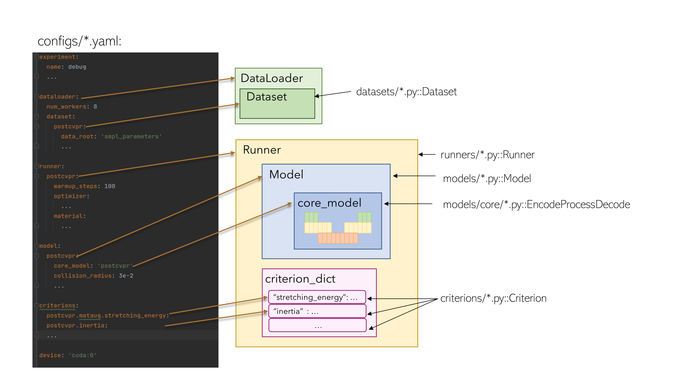
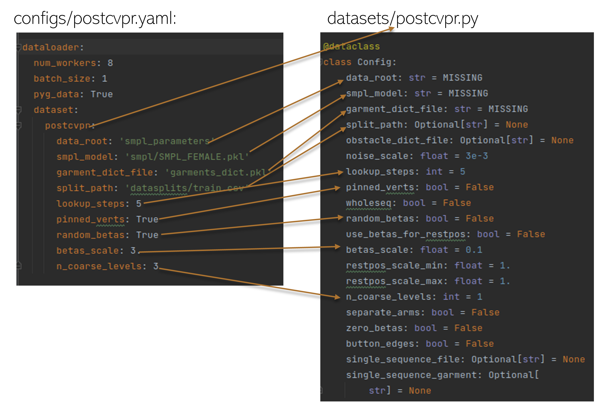

# Repository structure

This repository has a modular structure, where you can have multiple implementations for each module and switch between 
them by changing the configuration file.

We use OmegaConf to manage the configuration files. Please, see 
[OmegaConf documentation](https://omegaconf.readthedocs.io) for more details.

The configuration files are stored in `configs/` directory.
Each of them has configurations for four main modules of the pipeline:

* `dataset` is a module for data loading and preprocessing. dataset modules are stored in `datasets/` directory. Each dataset module defined a `Dataset` class.
* `model` is a module where a GNN model is defined. model modules are stored in `models/` directory. Each model module defines a `Model` class which inherits from `torch.nn.Module`.
  * The `Model` objects create an input graph, passes it through the GNN and returns the predicted accelerations.
  * The GNN architecture is defined in the `core_model` module. These are stored in `models/core_models/` directory. Each core model module defines a `EncodeProcessDecode` class.
* `runner` module defines the training and validation loops. runner modules are stored in `runners/` directory. Each runner module defines 
  * `Runner` class which defines:
    * `valid_rollout()` method used to generate a sequence of garment geometries for validation
    * `forward()` method used in training. It runs a forward pass of the model and performs an optimization step.
  * `create_optimizer()` function that builds an optimizer and a scheduler for the training process
  * `run_epoch()` with iterates over the dataloader and calls runner.forward() for each training sample
* `criterions` are modules that define the objective terms. One configuration file 
may have an unlimited number of criterions, their values are summed up. criterion modules are stored in `criterions/` directory. Each criterion module defines a `Criterion` class which inherits from `torch.nn.Module`.

Each module also defines a `Config` class which defines its parameters. Their value may be overridden in the configuration file on in the command line (see OmegaConf documentation). 

## Pytorch Geometric for handling graphs
We use [Pytorch Geometric](https://github.com/pyg-team/pytorch_geometric) to handle the graph data and rune message-passing steps.

For details, please, see [Pytorch Geometric documentation](https://pytorch-geometric.readthedocs.io/) and [datasets/README.md](datasets/README.md).