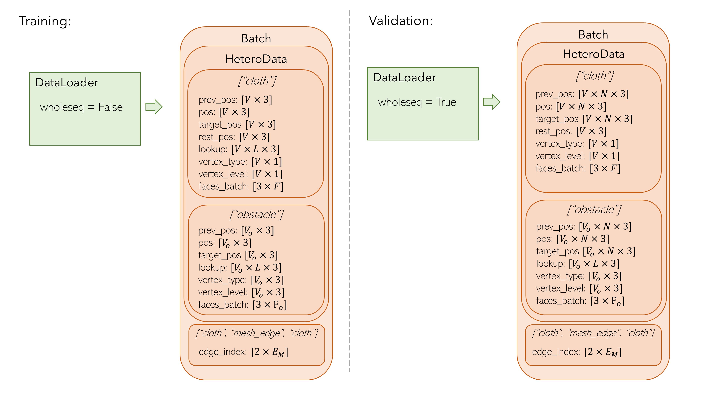

# Data Handling

We store the data for each training sample or a validation sequence in [HeteroData](https://pytorch-geometric.readthedocs.io/en/latest/generated/torch_geometric.data.HeteroData.html#torch_geometric.data.HeteroData) wrapped in a [Batch](https://pytorch-geometric.readthedocs.io/en/latest/generated/torch_geometric.data.Batch.html#torch_geometric.data.Batch) object from pytorch geometric library.

## Nodes of the graph
Each sample has two sets of nodes: `"cloth"` for garment nodes and `"obstacle"` for body nodes.

Each of this node types is a dictionary inside the `Batch` object that srotes all data for this node type (see picture below). This data can be accessed with `sample[NODE_TYPE]` where NODE_TYPE is either `"cloth"` or `"obstacle"`.

## Edges of the graph
The Batch object also stores data for the edges of the graph which can be accessed with `sample[SOURCE_NODES, EDGE_TYPE, TARGET_NODES]` where `SOURCE_NODES` and `TARGET_NODES`].

The batch built in the dataset only has a set of *mesh edges* (extracted from the garment mesh) accessed by `sample["cloth", "mesh_edge", "cloth"]`.

During the forward pass of the `Model` we also add proximity-based *world edges* (named *body edges* in the paper): both direct (`sample["cloth", "world_edge", "obstacle"]`) and inverse (`sample["obstacle", "world_edge", "cloth"]`).

## Dataset's `wholeseq` parameter

`wholeseq` parameter of the Dataset, controls whether the dataset returns (if `True`) a whole sequence of body poses or (if `False`) only a small window of the sequence.
* `wholeseq=False` is used for training 
* `wholeseq=True` is used for validation and testing

## Batch size
As the HOOD model is locally applied to each node of the input graph, it can be trained with `batch_size=1` (one pose sequence in a batch).

Because of that, we only use `batch_size=1` in this repository. Larger batch sizes are not supported.
